# Intune Security Policies Deployment Flow

This document provides a comprehensive flowchart of the Intune Security Policies deployment process, showing the interaction between the User, PowerShell Script, and Microsoft Graph/Intune services.

## Overview

The deployment process includes:
- 7 main deployment steps
- 3 security policy types (LLMNR, USB Block, NETBIOS/WPAD)
- Error handling and retry mechanisms
- Complete flow from initialization to completion

## Deployment Flow Diagram

```mermaid
flowchart TD
    Start([Start Deployment]) --> Init[Initialize Script]
    
    subgraph User["👤 User"]
        Start
        Review[Review Deployment Results]
        Decision{Deployment Successful?}
        EndSuccess([✅ Deployment Complete])
        EndFailure([❌ Deployment Failed])
    end
    
    subgraph PowerShell["⚙️ PowerShell Script"]
        Init
        
        Step1[Step 1: Load Configuration]
        Step2[Step 2: Authenticate to Microsoft Graph]
        Step3[Step 3: Validate Tenant Connection]
        Step4[Step 4: Prepare Policy Definitions]
        Step5[Step 5: Deploy Security Policies]
        Step6[Step 6: Verify Deployments]
        Step7[Step 7: Generate Report]
        
        ErrorHandler{Error Detected?}
        LogError[Log Error Details]
        RetryLogic{Retry Available?}
        IncrementRetry[Increment Retry Counter]
        MaxRetries{Max Retries Reached?}
        
        Init --> Step1
        Step1 --> Step2
        Step2 --> Step3
        Step3 --> Step4
        Step4 --> Step5
        
        subgraph PolicyDeployment["📋 Policy Deployment (Step 5)"]
            DeployStart[Begin Policy Deployment]
            
            subgraph LLMNR["🔒 LLMNR Policy"]
                LLMNR_Check[Check Existing LLMNR Policy]
                LLMNR_Create[Create LLMNR Configuration]
                LLMNR_Deploy[Deploy to Intune]
                LLMNR_Assign[Assign to Target Groups]
                LLMNR_Verify[Verify LLMNR Deployment]
                
                LLMNR_Check --> LLMNR_Create
                LLMNR_Create --> LLMNR_Deploy
                LLMNR_Deploy --> LLMNR_Assign
                LLMNR_Assign --> LLMNR_Verify
            end
            
            subgraph USBBlock["🔌 USB Block Policy"]
                USB_Check[Check Existing USB Policy]
                USB_Create[Create USB Block Configuration]
                USB_Deploy[Deploy to Intune]
                USB_Assign[Assign to Target Groups]
                USB_Verify[Verify USB Deployment]
                
                USB_Check --> USB_Create
                USB_Create --> USB_Deploy
                USB_Deploy --> USB_Assign
                USB_Assign --> USB_Verify
            end
            
            subgraph NETBIOS["🌐 NETBIOS/WPAD Policy"]
                NB_Check[Check Existing NETBIOS/WPAD Policy]
                NB_Create[Create NETBIOS/WPAD Configuration]
                NB_Deploy[Deploy to Intune]
                NB_Assign[Assign to Target Groups]
                NB_Verify[Verify NETBIOS/WPAD Deployment]
                
                NB_Check --> NB_Create
                NB_Create --> NB_Deploy
                NB_Deploy --> NB_Assign
                NB_Assign --> NB_Verify
            end
            
            DeployStart --> LLMNR_Check
            LLMNR_Verify --> USB_Check
            USB_Verify --> NB_Check
            NB_Verify --> DeployComplete[All Policies Deployed]
        end
        
        Step5 --> DeployStart
        DeployComplete --> Step6
        Step6 --> Step7
        Step7 --> Review
    end
    
    subgraph MSGraph["☁️ Microsoft Graph/Intune"]
        AuthEndpoint[Authentication Endpoint]
        GraphAPI[Microsoft Graph API]
        IntuneService[Intune Service]
        
        ValidateTenant[Validate Tenant Access]
        CreatePolicy[Create Policy Configuration]
        StorePolicy[Store Policy in Intune]
        AssignGroups[Assign to Device Groups]
        SyncStatus[Return Sync Status]
        
        AuthEndpoint --> GraphAPI
        GraphAPI --> IntuneService
        IntuneService --> ValidateTenant
        IntuneService --> CreatePolicy
        CreatePolicy --> StorePolicy
        StorePolicy --> AssignGroups
        AssignGroups --> SyncStatus
    end
    
    %% Connections between swimlanes
    Step2 -.->|Request Authentication| AuthEndpoint
    AuthEndpoint -.->|Return Access Token| Step2
    
    Step3 -.->|Validate Tenant| ValidateTenant
    ValidateTenant -.->|Tenant Validated| Step3
    
    LLMNR_Deploy -.->|POST Policy| CreatePolicy
    USB_Deploy -.->|POST Policy| CreatePolicy
    NB_Deploy -.->|POST Policy| CreatePolicy
    
    LLMNR_Assign -.->|Assign Groups| AssignGroups
    USB_Assign -.->|Assign Groups| AssignGroups
    NB_Assign -.->|Assign Groups| AssignGroups
    
    Step6 -.->|Query Status| SyncStatus
    SyncStatus -.->|Return Status| Step6
    
    %% Error Handling Paths
    Step1 --> ErrorHandler
    Step2 --> ErrorHandler
    Step3 --> ErrorHandler
    Step4 --> ErrorHandler
    DeployStart --> ErrorHandler
    LLMNR_Deploy --> ErrorHandler
    USB_Deploy --> ErrorHandler
    NB_Deploy --> ErrorHandler
    Step6 --> ErrorHandler
    
    ErrorHandler -->|Yes| LogError
    ErrorHandler -->|No| Step7
    
    LogError --> RetryLogic
    RetryLogic -->|Yes| IncrementRetry
    RetryLogic -->|No| EndFailure
    
    IncrementRetry --> MaxRetries
    MaxRetries -->|No| Step2
    MaxRetries -->|Yes| EndFailure
    
    Review --> Decision
    Decision -->|Yes| EndSuccess
    Decision -->|No| EndFailure
    
    %% Styling
    classDef userClass fill:#e1f5ff,stroke:#0288d1,stroke-width:2px
    classDef scriptClass fill:#fff3e0,stroke:#f57c00,stroke-width:2px
    classDef graphClass fill:#f3e5f5,stroke:#7b1fa2,stroke-width:2px
    classDef errorClass fill:#ffebee,stroke:#c62828,stroke-width:2px
    classDef successClass fill:#e8f5e9,stroke:#388e3c,stroke-width:2px
    classDef policyClass fill:#fff9c4,stroke:#f9a825,stroke-width:2px
    
    class Start,Review,Decision,EndSuccess,EndFailure userClass
    class Init,Step1,Step2,Step3,Step4,Step5,Step6,Step7 scriptClass
    class AuthEndpoint,GraphAPI,IntuneService,ValidateTenant,CreatePolicy,StorePolicy,AssignGroups,SyncStatus graphClass
    class ErrorHandler,LogError,RetryLogic,IncrementRetry,MaxRetries errorClass
    class EndSuccess successClass
    class LLMNR_Check,LLMNR_Create,LLMNR_Deploy,LLMNR_Assign,LLMNR_Verify policyClass
    class USB_Check,USB_Create,USB_Deploy,USB_Assign,USB_Verify policyClass
    class NB_Check,NB_Create,NB_Deploy,NB_Assign,NB_Verify policyClass
```

## Process Steps Description

### Step 1: Load Configuration
- Load script configuration and parameters
- Read policy definitions from configuration files
- Initialize logging mechanism

### Step 2: Authenticate to Microsoft Graph
- Connect to Microsoft Graph API
- Obtain access token with appropriate permissions
- Required permissions: `DeviceManagementConfiguration.ReadWrite.All`

### Step 3: Validate Tenant Connection
- Verify tenant ID and access
- Confirm Graph API connectivity
- Validate user permissions

### Step 4: Prepare Policy Definitions
- Load LLMNR policy template
- Load USB Block policy template
- Load NETBIOS/WPAD policy template
- Validate JSON policy structures

### Step 5: Deploy Security Policies
Deploy three security policies in sequence:

#### 5.1 LLMNR Policy
- Disables Link-Local Multicast Name Resolution
- Prevents LLMNR spoofing attacks
- Applies to all Windows 10/11 devices

#### 5.2 USB Block Policy
- Restricts removable storage access
- Prevents unauthorized data exfiltration
- Configurable by device groups

#### 5.3 NETBIOS/WPAD Policy
- Disables NETBIOS over TCP/IP
- Disables Web Proxy Auto-Discovery (WPAD)
- Prevents man-in-the-middle attacks

### Step 6: Verify Deployments
- Check policy creation status
- Verify group assignments
- Confirm policy synchronization

### Step 7: Generate Report
- Compile deployment results
- Generate success/failure report
- Export logs and documentation

## Error Handling

The script implements robust error handling:

1. **Error Detection**: Each step validates completion before proceeding
2. **Logging**: All errors are logged with timestamp and details
3. **Retry Logic**: Automatic retry for transient failures (max 3 attempts)
4. **Graceful Failure**: Script exits cleanly with error report if max retries exceeded

## Policy Details

| Policy Name | Purpose | Target | OMA-URI Settings |
|------------|---------|--------|------------------|
| LLMNR Disable | Prevent LLMNR spoofing | All Devices | `./Vendor/MSFT/Policy/Config/NetworkIsolation/EnterpriseProxyServersAreAuthoritative` |
| USB Block | Restrict removable storage | Specified Groups | `./Vendor/MSFT/Policy/Config/Storage/RemovableDiskDenyWriteAccess` |
| NETBIOS/WPAD Disable | Prevent protocol attacks | All Devices | Multiple registry-based settings |

## Prerequisites

- PowerShell 5.1 or later
- Microsoft.Graph PowerShell module
- Azure AD account with Intune Administrator role
- Appropriate Microsoft Graph API permissions

## Deployment Timeline

## Best Practices

1. **Test in Development First**: Always test policies in a development tenant
2. **Backup Existing Policies**: Export current configurations before deployment
3. **Monitor Deployment**: Watch the deployment status in Intune portal
4. **Staged Rollout**: Consider deploying to pilot groups first
5. **Documentation**: Keep detailed logs of all deployments

## Troubleshooting

### Common Issues

| Issue | Possible Cause | Resolution |
|-------|---------------|------------|
| Authentication Failed | Insufficient permissions | Verify account has Intune Administrator role |
| Policy Creation Failed | Invalid JSON structure | Validate policy template syntax |
| Assignment Failed | Group not found | Verify Azure AD group exists |
| Deployment Timeout | Network connectivity | Check firewall and proxy settings |

## Related Documentation

- [Microsoft Graph API Documentation](https://docs.microsoft.com/graph)
- [Intune Configuration Policies](https://docs.microsoft.com/intune)
- [PowerShell Script Repository](../scripts/)

---

**Document Version**: 1.0  
**Last Updated**: 2025-12-29  
**Author**: Riz7886  
**Status**: Production Ready
